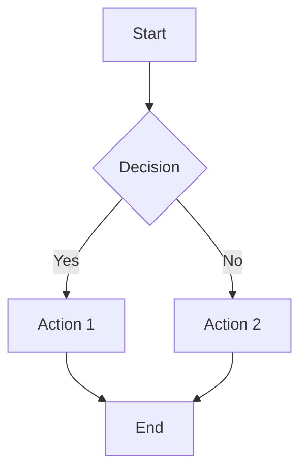
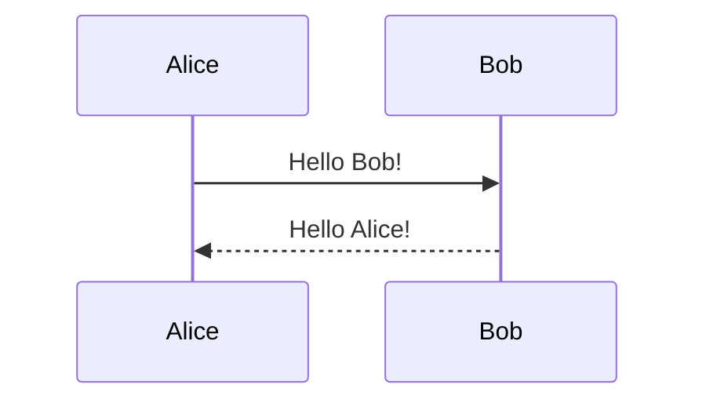

# Complete Markdown Cheatsheet

*A comprehensive reference guide for Markdown syntax and advanced features*

## Table of Contents

1. [Basic Syntax](#basic-syntax)
2. [Extended Syntax](#extended-syntax)
3. [GitHub Flavored Markdown](#github-flavored-markdown)
4. [HTML Integration](#html-integration)
5. [Advanced Features](#advanced-features)
6. [Best Practices](#best-practices)
7. [Troubleshooting](#troubleshooting)

## Basic Syntax

### Headers

```markdown
# H1 Header
## H2 Header
### H3 Header
#### H4 Header
##### H5 Header
###### H6 Header
```

Alternative syntax for H1 and H2:
```markdown
H1 Header
=========

H2 Header
---------
```

### Text Formatting

**Bold Text**
```markdown
**bold text**
__bold text__
```

*Italic Text*
```markdown
*italic text*
_italic text_
```

***Bold and Italic***
```markdown
***bold and italic***
___bold and italic___
**_bold and italic_**
__*bold and italic*__
```

~~Strikethrough~~
```markdown
~~strikethrough text~~
```

### Paragraphs and Line Breaks

Create paragraphs by separating text with blank lines.

For line breaks within a paragraph,  
end a line with two or more spaces.

```markdown
First paragraph.

Second paragraph.

Line break with two spaces at end  
creates a new line in same paragraph.
```

### Lists

#### Unordered Lists
```markdown
- Item 1
- Item 2
  - Nested item 2.1
  - Nested item 2.2
- Item 3

* Alternative syntax
+ Another alternative
```

#### Ordered Lists
```markdown
1. First item
2. Second item
   1. Nested item
   2. Another nested item
3. Third item

1. You can use 1. for all items
1. Markdown will auto-number
1. Makes reordering easier
```

### Links

```markdown
[Link text](https://example.com)
[Link with title](https://example.com "Optional title")

Reference-style links:
[Link text][reference]
[Another link][1]

[reference]: https://example.com
[1]: https://example.com "Optional title"

Automatic links:
<https://example.com>
<email@example.com>
```

### Images

```markdown


Reference-style images:
![Alt text][image-reference]

[image-reference]: image.jpg "Optional title"
```

### Code

#### Inline Code
```markdown
Use `backticks` for inline code.
```

#### Code Blocks
````markdown
```
Basic code block
```

```python
# Syntax highlighted code block
def hello_world():
    print("Hello, World!")
```

```javascript
// JavaScript example
function greet(name) {
    return `Hello, ${name}!`;
}
```
````

### Blockquotes

```markdown
> This is a blockquote.
> 
> Multiple paragraphs in blockquote.

> Nested blockquotes
>> Second level
>>> Third level

> Blockquotes can contain other elements:
> 
> - Lists
> - **Bold text**
> - `Code`
```

### Horizontal Rules

```markdown
---
***
___
```

## Extended Syntax

### Tables

```markdown
| Header 1 | Header 2 | Header 3 |
|----------|----------|----------|
| Cell 1   | Cell 2   | Cell 3   |
| Cell 4   | Cell 5   | Cell 6   |

Alignment:
| Left | Center | Right |
|:-----|:------:|------:|
| L1   |   C1   |    R1 |
| L2   |   C2   |    R2 |
```

### Footnotes

```markdown
Here's a sentence with a footnote[^1].

Another footnote[^note].

[^1]: This is the first footnote.
[^note]: This is a named footnote.
```

### Definition Lists

```markdown
Term 1
: Definition 1

Term 2
: Definition 2a
: Definition 2b
```

### Task Lists

```markdown
- [x] Completed task
- [ ] Incomplete task
- [ ] Another incomplete task
  - [x] Nested completed task
  - [ ] Nested incomplete task
```

### Abbreviations

```markdown
*[HTML]: Hyper Text Markup Language
*[W3C]: World Wide Web Consortium

The HTML specification is maintained by the W3C.
```

## GitHub Flavored Markdown

### Syntax Highlighting

````markdown
```diff
- Removed line
+ Added line
! Changed line
# Comment line
```

```json
{
  "name": "example",
  "version": "1.0.0"
}
```
````

### Mentions and References

```markdown
@username mentions a user
#123 references an issue or pull request
SHA: a5c3785ed8d6a35868bc169f07e40e889087fd2e
User@SHA: jlord@a5c3785ed8d6a35868bc169f07e40e889087fd2e
User/Repository#123: jlord/sheetsee.js#26
```

### Collapsible Sections

```markdown
<details>
<summary>Click to expand</summary>

This content is hidden by default.

- You can include any markdown here
- Lists, code blocks, etc.

</details>
```

## HTML Integration

### Basic HTML Tags

```markdown
You can use <strong>HTML tags</strong> in Markdown.

<div align="center">
  Centered content
</div>

<kbd>Ctrl</kbd> + <kbd>C</kbd> for keyboard shortcuts

<sub>subscript</sub> and <sup>superscript</sup>

<mark>highlighted text</mark>
```

### Images with HTML

```markdown


<picture>
  <source media="(prefers-color-scheme: dark)" srcset="dark-image.png">
  <source media="(prefers-color-scheme: light)" srcset="light-image.png">
  
</picture>
```

### Advanced HTML

```markdown
<details>
<summary><strong>Expandable Section</strong></summary>

### Content inside collapsible section

You can put **any markdown** here including:

- Lists
- Code blocks
- Images
- Tables

</details>
```

## Advanced Features

### Math Expressions (MathJax)

```markdown
Inline math: $E = mc^2$

Block math:
$$
\sum_{i=1}^{n} x_i = x_1 + x_2 + \cdots + x_n
$$

LaTeX expressions:
$$
\begin{align}
f(x) &= ax^2 + bx + c \\
g(x) &= dx + e
\end{align}
$$
```

### Mermaid Diagrams

````markdown



````

### Badges and Shields

```markdown


[](https://github.com/username/repo/stargazers)
```

### GitHub-Specific Features

```markdown
<!-- GitHub light/dark mode images -->
<a href="#gh-light-mode-only">
  
</a>
<a href="#gh-dark-mode-only">
  
</a>

<!-- Pinned repositories -->
[](https://github.com/username/repo)
```

## Best Practices

### File Organization

```markdown
# Project Title

Brief description of the project.

## Table of Contents

- [Installation](#installation)
- [Usage](#usage)
- [Contributing](#contributing)
- [License](#license)

## Installation

Step-by-step installation instructions.

## Usage

Examples and usage instructions.

## Contributing

Guidelines for contributors.

## License

License information.
```

### Writing Guidelines

1. **Use descriptive link text**
   ```markdown
   <!-- Good -->
   [Download the latest version](https://example.com/download)
   
   <!-- Avoid -->
   [Click here](https://example.com/download)
   ```

2. **Add alt text to images**
   ```markdown
   
   ```

3. **Use consistent heading hierarchy**
   ```markdown
   # Main Title (H1)
   ## Major Sections (H2)
   ### Subsections (H3)
   #### Minor Subsections (H4)
   ```

4. **Keep line lengths reasonable**
   - Aim for 80-100 characters per line
   - Break long sentences into multiple lines

### Accessibility

```markdown
<!-- Use descriptive alt text -->


<!-- Use semantic HTML when needed -->
<table role="table">
  <caption>Quarterly Sales Data</caption>
  <thead>
    <tr>
      <th scope="col">Quarter</th>
      <th scope="col">Sales</th>
    </tr>
  </thead>
  <tbody>
    <tr>
      <td>Q1</td>
      <td>$10,000</td>
    </tr>
  </tbody>
</table>
```

## Troubleshooting

### Common Issues

#### Lists Not Rendering Correctly
```markdown
<!-- Problem: Missing blank line before list -->
Here's a list:
- Item 1
- Item 2

<!-- Solution: Add blank line -->
Here's a list:

- Item 1
- Item 2
```

#### Code Blocks Not Highlighting
````markdown
<!-- Problem: Wrong language identifier -->
```js
function example() {}
```

<!-- Solution: Use correct identifier -->
```javascript
function example() {}
```
````

#### Links Not Working
```markdown
<!-- Problem: Missing protocol -->
[Example](example.com)

<!-- Solution: Include protocol -->
[Example](https://example.com)
```

### Platform-Specific Differences

| Feature | GitHub | GitLab | Bitbucket | Standard |
|---------|--------|--------|-----------|----------|
| Task Lists | ✅ | ✅ | ✅ | ❌ |
| Tables | ✅ | ✅ | ✅ | ✅ |
| Footnotes | ❌ | ✅ | ❌ | ✅ |
| Math | ✅ | ✅ | ❌ | ❌ |
| Mermaid | ✅ | ✅ | ❌ | ❌ |

### Escape Characters

```markdown
Use backslash to escape special characters:

\*Not italic\*
\[Not a link\]
\`Not code\`
\# Not a header

Literal backslash: \\
```

### Performance Tips

1. **Optimize images**
   - Use appropriate file formats (WebP, PNG, JPEG)
   - Compress images before uploading
   - Consider using CDN for large files

2. **Minimize HTML usage**
   - Use Markdown syntax when possible
   - HTML should be for features not available in Markdown

3. **Structure documents logically**
   - Use proper heading hierarchy
   - Include table of contents for long documents
   - Break large documents into smaller files

## Supported File Extensions

Common Markdown file extensions:
- `.md` - Most common
- `.markdown` - Full name
- `.mdown` - Alternative
- `.mkd` - Short form
- `.mkdn` - Alternative short form

## Tools and Editors

### Online Editors
- GitHub's built-in editor
- GitLab's Web IDE
- StackEdit
- Dillinger

### Desktop Applications
- Typora
- Mark Text
- Obsidian
- Notion

### VS Code Extensions
- Markdown All in One
- Markdown Preview Enhanced
- markdownlint

## Resources

- [CommonMark Specification](https://commonmark.org/)
- [GitHub Flavored Markdown Spec](https://github.github.com/gfm/)
- [Markdown Guide](https://www.markdownguide.org/)
- [Awesome Markdown](https://github.com/mundimark/awesome-markdown)

---

*This cheatsheet covers the most commonly used Markdown features. For platform-specific features, consult the documentation of your Markdown processor.*